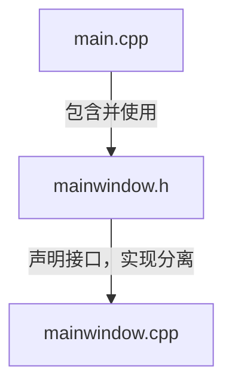

# Deploy the vscode development environment for windows

Qt6 部署开发环境: Windows / MSYS2 + MINGW64 / Visual Studio Code

- [自动创建Qt项目](create_qt6_project.py)
- Qt Creator 创建的 Qt 项目在使用 vscode 开发时，需要创建 `.vscode` 目录进行相关配置
  - [c_cpp_properties.json](qtcreator/c_cpp_properties.json)
  - [launch.json](qtcreator/launch.json)
  - [settings.json](qtcreator/settings.json)
  - [tasks.json](qtcreator/tasks.json)

```sh
# 更新MSYS2包数据库
pacman -Syu

# 安装MinGW64版本的Qt6开发包
pacman -S mingw-w64-x86_64-qt6-base mingw-w64-x86_64-qt6-tools mingw-w64-x86_64-qt-creator

# 安装编译工具链和其他必要工具
pacman -S mingw-w64-x86_64-gcc mingw-w64-x86_64-cmake mingw-w64-x86_64-make mingw-w64-x86_64-gdb
```

## 必要的 VS Code 扩展

- `C/C++ (Microsoft)` 提供 C++ 智能感知和调试支持
- `CMake` CMake 语法高亮
- `CMake Tools (Microsoft)` CMake 项目管理
- `Qt C++ Extension Pack` 推荐用于Qt C++开发的扩展程序
- `Qt Tools` Qt 相关工具支持

### 环境变量

- 系统环境变量 `C:\msys64\mingw64\bin`
- vscode `C:\Users\misaka\AppData\Roaming\Code\User\settings.json`

```json
{
    "terminal.integrated.env.windows": {
        "PATH": "C:\\msys64\\mingw64\\bin;C:\\msys64\\usr\\bin;${env:PATH}"
    }
}
```

## 各文件的作用

### 1. main.cpp（应用程序入口点）

```cpp
#include <QApplication>
#include "mainwindow.h"

int main(int argc, char *argv[])
{
    QApplication app(argc, argv);  // 创建 Qt 应用程序对象
    MainWindow window;              // 创建主窗口实例
    window.show();                  // 显示主窗口
    return app.exec();             // 进入事件循环
}
```

- **作用**：程序的入口点，负责初始化 Qt 应用程序并启动主窗口
- **职责**：创建 QApplication 对象、实例化主窗口、启动事件循环

### 2. mainwindow.h（主窗口声明）

```cpp
#ifndef MAINWINDOW_H
#define MAINWINDOW_H

#include <QMainWindow>

class MainWindow : public QMainWindow  // 继承 QMainWindow
{
    Q_OBJECT  // Qt 元对象系统宏

public:
    MainWindow(QWidget *parent = nullptr);  // 构造函数
    ~MainWindow();                          // 析构函数

private:
    // 私有成员变量，如 UI 对象指针
};

#endif
```

- **作用**：声明主窗口类的接口和结构
- **职责**：定义类的公共接口、信号、槽和私有成员

### 3. mainwindow.cpp（主窗口实现）

```cpp
#include "mainwindow.h"
#include "ui_widget.h"

MainWindow::MainWindow(QWidget *parent)
    : QMainWindow(parent)
    , ui(new Ui::MainWindow)
{
    ui->setupUi(this);  // 设置 UI 界面
}

MainWindow::~MainWindow()
{
    delete ui;  // 清理资源
}
```

- **作用**：实现主窗口类的具体功能
- **职责**：实现构造函数、析构函数和各种成员函数

## 相互关系图



## 工作流程

1. **编译阶段**：
   - 编译器先处理 `mainwindow.h`，了解类的结构
   - 然后编译 `mainwindow.cpp`，实现具体功能
   - 最后编译 `main.cpp` ，作为程序入口

2. **运行阶段**：
   - 程序从 `main()` 函数开始执行
   - 创建 `MainWindow` 对象
   - 调用 `MainWindow` 的构造函数（在 `mainwindow.cpp` 中实现）
   - 显示窗口并进入事件循环

## 分离的好处

1. **模块化**：职责分离，便于维护和理解
2. **复用性**：`MainWindow` 类可以在其他项目中复用
3. **编译效率**：修改实现时不需要重新编译其他文件
4. **团队协作**：不同开发者可以同时工作在不同文件上

这种组织方式是 C++/Qt 项目的标准模式，遵循了面向对象设计的"接口与实现分离"原则。

## 相关配置文件及作用

### 配置 CMake 构建预设

`CMakePresets.json`

- 定义构建工具链和编译器路径
- 指定使用 MinGW Makefiles 生成器
- 设置 CMake 缓存变量（编译器路径等）

```json
{
    // CMake Presets 文件格式版本为 3
    "version": 3,
    // 定义配置预设数组
    "configurePresets": [
        {
            // 预设的名称
            "name": "mingw64",
            // 在 IDE 中显示的友好名称
            "displayName": "MinGW64",
            // 指定 CMake 使用的构建系统生成器
            "generator": "MinGW Makefiles",
            // 指定工具链文件路径，此处为空表示使用默认工具链
            "toolchainFile": "",
            // 定义 CMake 缓存变量，这些变量会传递给 CMake 配置过程
            "cacheVariables": {
                // 指定 C 语言编译器为 MSYS2 MinGW64 中的 gcc
                "CMAKE_C_COMPILER": "C:/msys64/mingw64/bin/gcc.exe",
                // 指定 C++ 编译器为 MSYS2 MinGW64 中的 g++
                "CMAKE_CXX_COMPILER": "C:/msys64/mingw64/bin/g++.exe",
                // 指定 make 程序为 MSYS2 MinGW64 中的 mingw32-make
                "CMAKE_MAKE_PROGRAM": "C:/msys64/mingw64/bin/mingw32-make.exe"
            },
            // 仅当主机系统是 Windows 时才启用此配置
            "condition": {
                "type": "equals",
                // ${hostSystemName} 是 CMake 的预定义变量，表示当前操作系统名称
                "lhs": "${hostSystemName}",
                "rhs": "Windows"
            }
        }
    ]
}
```

### 配置 C/C++ IntelliSense 和代码补全

`.vscode/c_cpp_properties.json`

- 设置头文件搜索路径（包括 Qt 头文件路径）
- 指定编译器路径用于代码分析
- 配置 C/C++ 标准版本
- 启用代码智能提示和错误检查

```json
{
    "configurations": [
        {
            "name": "Win32",
            "includePath": [
                "${workspaceFolder}/**",
                "C:/msys64/mingw64/include/**",
                "C:/msys64/mingw64/include/qt6/**"
            ],
            "defines": [],
            "compilerPath": "C:/msys64/mingw64/bin/g++.exe",
            "cStandard": "c17",
            "cppStandard": "c++17",
            "intelliSenseMode": "gcc-x64"
        }
    ],
    "version": 4
}
```

### 配置构建任务

`.vscode/tasks.json`

- 定义项目配置和构建命令
- 设置构建输出路径
- 配置错误信息解析器
- 可以通过 Ctrl+Shift+P 调用构建任务

```json
{
    // 文件格式版本
    "version": "2.0.0",
    // 定义任务数组
    "tasks": [
        // 配置项目，生成构建文件
        {
            // 任务名称标签，用于在 VS Code 中识别和调用此任务
            "label": "cmake configure",
            // 指定任务类型为 shell 命令，在终端中执行
            "type": "shell",
            // 要执行的命令，这里是 cmake 命令
            "command": "cmake",
            // 传递给 cmake 命令的参数
            "args": [
                // 指定构建目录为 "build"
                "-B",
                "build",
                // 指定源代码目录为当前目录
                "-S",
                ".",
                // 指定生成器为 MinGW Makefiles
                "-G",
                "MinGW Makefiles"
            ],
            // 将此任务归类为构建组，可以通过 "Run Build Task" 命令调用
            "group": "build",
            // 控制任务执行时终端的行为
            "presentation": {
                // 在终端中显示执行的命令
                "echo": true,
                // 总是显示终端面板
                "reveal": "always",
                // 执行时终端不获得焦点
                "focus": false,
                // 使用共享终端面板
                "panel": "shared"
            },
            // 使用 Microsoft 编译器格式的问题匹配器来解析编译错误和警告
            "problemMatcher": "$msCompile"
        },
        // 执行实际的编译构建过程
        {
            "label": "cmake build",
            "type": "shell",
            "command": "cmake",
            "args": [
                "--build",
                "build"
            ],
            "group": "build",
            "presentation": {
                "echo": true,
                "reveal": "always",
                "focus": false,
                "panel": "shared"
            },
            "problemMatcher": "$msCompile",
            "dependsOn": "cmake configure"
        }
    ]
}
```

### 配置调试器

`.vscode/launch.json`

- 设置调试器类型（cppdbg）
- 指定可执行文件路径
- 配置 GDB 调试器路径
- 设置调试前的构建任务依赖
- 配置调试环境变量

```json
{
    // 调试配置文件格式版本
    "version": "0.2.0",
    // 调试配置数组
    "configurations": [
        {
            // 调试配置名称，在调试面板中显示
            "name": "Debug Qt Application",
            // 调试器类型，使用 C++ 调试器
            "type": "cppdbg",
            // 请求类型，launch 表示启动新进程进行调试
            "request": "launch",
            // 要调试的可执行文件路径，需要替换为实际的程序名
            "program": "${workspaceFolder}/build/your_program.exe",
            // 传递给程序的命令行参数，此处为空
            "args": [],
            // 是否在程序入口点停止，false 表示不暂停
            "stopAtEntry": false,
            // 程序运行时的工作目录
            "cwd": "${workspaceFolder}",
            // 环境变量设置，此处为空表示使用默认环境
            "environment": [],
            // 是否使用外部控制台，false 表示在 VS Code 内部终端运行
            "externalConsole": false,
            // 使用的调试器类型，这里使用 GDB
            "MIMode": "gdb",
            // GDB 调试器的路径
            "miDebuggerPath": "C:/msys64/mingw64/bin/gdb.exe",
            // 调试器启动时执行的命令
            "setupCommands": [
                {
                    // 命令描述：为 gdb 启用整齐打印
                    "description": "为 gdb 启用整齐打印",
                    // 实际执行的 gdb 命令，启用美化打印功能
                    "text": "-enable-pretty-printing",
                    // 是否忽略命令执行失败，true 表示即使失败也继续
                    "ignoreFailures": true
                }
            ],
            // 调试前要执行的任务，这里会先执行 cmake build 任务
            "preLaunchTask": "cmake build"
        }
    ]
}
```

### 项目构建脚本

`CMakeLists.txt`

- 定义项目名称和版本要求
- 查找 Qt6 组件（Core、Widgets 等）
- 添加可执行文件和源文件
- 链接 Qt 库
- 配置资源文件（如 .qrc）

```txt
# 指定所需的最低 CMake 版本为 3.16
cmake_minimum_required(VERSION 3.16)

# 定义项目名称为 MyQtApp
project(MyQtApp)

# 设置 C++ 标准为 C++17
set(CMAKE_CXX_STANDARD 17)

# 设置为 Windows GUI 应用程序（不显示控制台窗口）
if(WIN32)
    set(CMAKE_EXE_LINKER_FLAGS "${{CMAKE_EXE_LINKER_FLAGS}} -mwindows")
endif()

# 设置 C++ 标准为强制要求，如果编译器不支持会报错
set(CMAKE_CXX_STANDARD_REQUIRED ON)

# 查找 Qt6 包，并要求 Core 和 Widgets 模块，如果找不到会报错
find_package(Qt6 REQUIRED COMPONENTS Core Widgets)

# 启用 Qt6 标准项目设置，包括自动处理 moc、uic、rcc 等
qt6_standard_project_setup()

# 创建可执行文件 myapp，并添加源文件和头文件
# Windows 平台使用 WIN32 参数避免控制台窗口
qt6_add_executable(myapp WIN32
    main.cpp
    mainwindow.cpp
    mainwindow.h
    widget.ui
)

# 为可执行文件添加资源文件
qt6_add_resources(myapp "resources"
    # 设置资源前缀为根目录
    PREFIX "/"
    # 指定资源文件列表
    FILES
        resources.qrc
)

# 链接 Qt6 的 Core 和 Widgets 库到可执行文件
target_link_libraries(myapp Qt6::Core Qt6::Widgets)
```

## 部署

```sh
# 配置 Release 构建
cmake -B build -S . -DCMAKE_BUILD_TYPE=Release
# 执行构建
cmake --build build --config Release
# 部署依赖库
windeployqt6 --release --no-translations --no-system-d3d-compiler build/QtProject.exe
```
