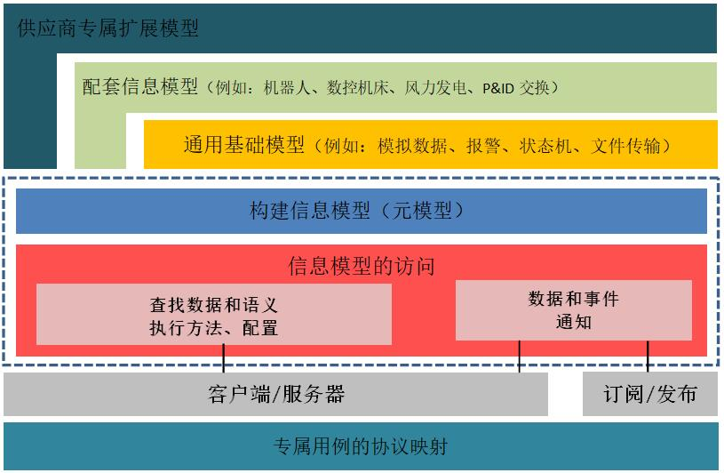

# 统一架构

统一架构（Unified Architecture）

2008年发布的OPC统一架构（UA）将各个OPC Classic规范的所有功能集成到一个可扩展的框架中，独立于平台并且面向服务。

这种多层级方法实现了最初设计UA规范时的目标：

- 功能对等性：所有COM OPC Classic规范都映射到UA
- 平台独立性：从嵌入式微控制器到基于云的基础设施
- 安全性：信息加密、身份认证和审核
- 可扩展性：添加新功能而不影响现有应用程序的能力
- 信息模型完整性：用于定义复杂信息

## 功能对等性

基于OPC Classic的成功，OPC基金会推出了新的技术标准OPC UA。

OPC UA实现了所有OPC Classic的功能，并有以下的增强和超越：

- 发现：在本地PC或网络上查找可用的OPC服务器
- 地址空间：所有数据分层显示（例如文件和文件夹），用于OPC客户端发现、利用简单和复杂的数据结构。
- 按需：基于访问权限读取和写入数据/信息
- 订阅：监测数据/信息，并在当值变化超出客户端的设定时报告异常
- 事件：基于客户端来设定通知重要信息
- 方法：客户端可以基于服务器定义的方法来执行程序等

OPC UA产品和OPC Classic产品之间的集成可以通过COM/Proxy Wrappers轻松实现。

## 平台独立性

鉴于市场上有各种各样的硬件平台和操作系统，平台独立性就显得至关重要。

OPC UA包含但不限于以下平台及系统：

- 硬件平台：传统PC硬件、云服务器、PLC、微控制器（ARM等）
- 操作系统：Microsoft Windows、Apple OSX、Android或任何Linux发行版本等

OPC UA为企业之间的互操作性提供必要的M2M、M2E及两者之间的基础架构。

## 安全性

企业在选择技术标准时最重要的考虑之一是安全性。OPC UA在通过防火墙时通过提供一套控制方案来解决安全问题：

- 传输：定义了许多协议，提供了诸如超快OPC二进制传输或更通用的SOAP-HTTPS等选项
- 会话加密：信息以不同的加密级别安全地传输
- 信息签名：信息签名可以保证准确和完整的接收信息
- 测序数据包：通过排序消除了已发现的信息重放攻击
- 身份认证：每个UA的客户端和服务器都要通过X509证书标识，从而决定哪些应用程序和系统可以互相连接。
- 用户控制：应用程序可以要求用户进行身份验证（登录凭据，证书等），并且可以进一步限制或增强用户访问权限和地址空间“视图”的能力
- 审计：记录用户和/或系统的活动，提供访问审计跟踪

## 可扩展性

OPC UA的多层架构提供了一个“面向未来”的框架。诸如新的传输协议、安全算法、编码标准或应用服务等创新技术和方法都可以并入OPC UA，同时保持现有产品的兼容性。今天的UA产品能够与未来的UA产品互联互通。

## 信息模型完整性

OPC UA信息建模框架将数据转换为信息。通过完全面向对象的功能，即使是最复杂的多层级结构也可以建模和扩展。

这一框架是OPC统一架构的基本元素。它定义了利用OPC UA公开信息模型所需的规则和基本模块。虽然OPC UA已经定义了应用于多个行业的核心模型，但是合作组织可以在这基础上建立其专属模型，并通过OPC UA公开其专属信息。

OPC UA还定义了信息模型的访问机制。

- 查找机制（浏览），以查找实例及其语义
- 读写实时数据和历史数据的操作
- 执行方法
- 通知数据和事件

对于客户端-服务器通信，可通过服务器获得全方位的信息模型访问权限，并且基于面向服务的架构（SOA）的设计范式，服务提供商通过该范式接收请求，处理请求并将结果返回给服务提供商。

发布/订阅（PubSub），是数据和事件通知的一种替代机制。在客户端-服务器通信中，每个通知都安全传送给单个客户端，而PubSub已针对多对多配置进行了优化。

使用PubSub，OPC UA的应用程序不会直接交换请求和响应。而是，发布者将消息发送到Message Oriented Middleware（面向消息的中间件），订阅者无需知晓。同样，如果订阅者对某些特定数据感兴趣，可以将包含此数据的信息打包处理，同样无需知晓数据的来源。

数据类型和结构在配置文件中定义。例如，现有的OPC Classic规范被建模为UA配置文件，也可以由合作组织扩展。

## 参考文献

- [OPC是什么](https://opcfoundation.cn/about/opc-technologies/opc-ua)