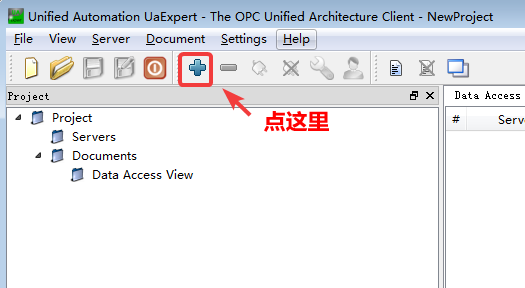
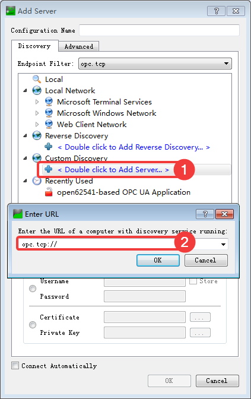
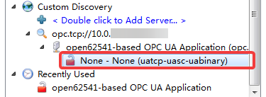
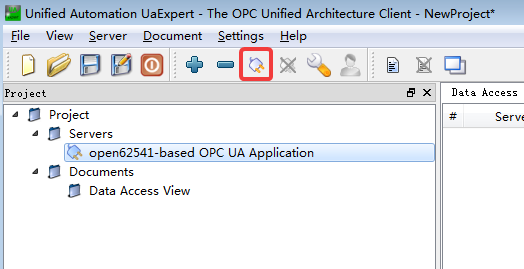
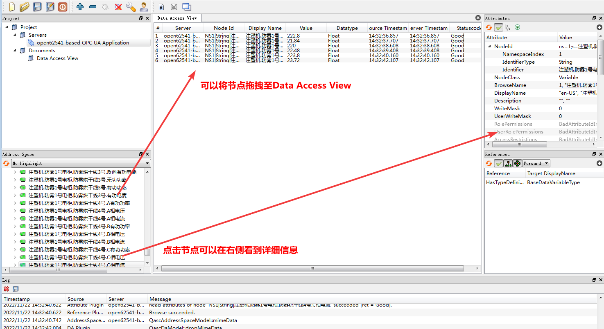

# UaExpert

UaExpert 是一个用C ++编写的跨平台OPC UA测试客户端。

## 下载

[官网](https://www.unified-automation.com/)
[下载](https://www.unified-automation.com/downloads/opc-ua-clients.html)

## 安装

下一步*N

## 首次使用

首次打开UaExpert会弹出窗口，需要填写Subject，制作安全证书（Certificate）

## 使用

点击＋号

在Custom Discovery下面的加号那一栏双击，在弹出的界面里输入server所在的ip和监听的端口号，并点击OK。

> Local Network （本地网络）
> Reverse Discovery （反向发现）
> Custom Discovery （自定义发现）

点击左侧 `>` 符号进行展开，然后等一小会就会出现server，然后双击。
左侧符号是一把红色的打开的锁，表示没有使用加密功能。

Project -> Servers 下出现这个server。
左侧符号是个插头，表示还未连接。
点击菜单栏的插头即可连接该服务器（Connect Server）

可以将节点拖拽至Data Access View
点击节点可以在右侧查看数据