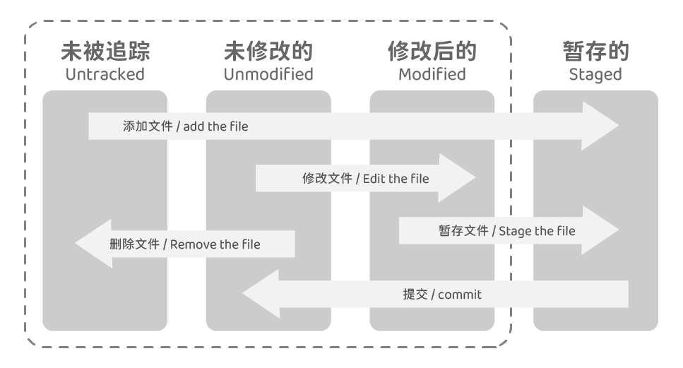
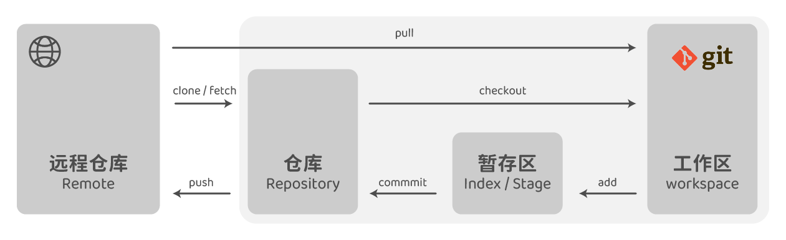

# Git 仓库

## 获取仓库

### 初始化一个新仓库

仓库，repository。
是使用 git 进行版本管理的一个目录。

```bash
# 创建仓库
git init
```

### 克隆现有的仓库

```bash
# 克隆仓库
git clone https://github.com/git/git.git
```

## 更新到仓库



### 对文件进行跟踪

仓库中的文件有两种状态，已跟踪和未跟踪。
已跟踪的文件会被纳入git的版本控制。

```bash
# 检查当前文件状态
git status
### 简洁输出
git status -s
git status -short

# 对一个或多个文件进行跟踪
git add <file>
# 对当前目录下所有文件进行跟踪
git add .
```

### 暂存已修改的文件

`git add` 可以开始跟踪新文件，或者把已跟踪的文件放到暂存区。

```bash
# 暂存已修改的文件
git add .
```

### 忽略文件

总会有一些不需要跟踪的文件，可以创建一个名为 `.gitignore` 的文件，列出要忽略的文件的模式。

#### 格式

- 所有空行或者以 `#` 开头的行都会被 Git 忽略。
- 可以使用标准的 glob 模式匹配，它会递归地应用在整个工作区中。
- 匹配模式可以以（`/`）开头防止递归。
- 匹配模式可以以（`/`）结尾指定目录。
- 要忽略指定模式以外的文件或目录，可以在模式前加上叹号（`!`）取反。

> glob 模式指 shell 所使用的简化了的正则表达式。
>
> - 星号（*）匹配零个或多个任意字符
> - 问号（?）只匹配一个任意字符
> - [abc] 匹配任何一个列在方括号中的字符（这个例子要么匹配一个a，要么匹配一个b，要么匹配一个c）
> - 如果在方括号中使用短划线分隔两个字符，表示所有在这两个字符范围内的都可以匹配（比如 [0-9] 表示匹配所有 0 到 9 的数字）。
> - 使用两个星号（\*\*）表示匹配任意中间目录，比如 a/\*\*/z 可以匹配 a/z 、 a/b/z 或 a/b/c/z 等。

GitHub 有一个十分详细的针对数十种项目及语言的 .gitignore 文件列表。
[https://github.com/github/gitignore](https://github.com/github/gitignore)

### 查看已暂存和未暂存的修改

```bash
# 未暂存的修改
git diff
# 已暂存的，将要添加到下次提交里的内容
### --staged 和 --cached 是同义词
git diff --staged
git diff --cached
```

### 提交更新

```bsh
# 提交更新
git commit
# 提交更新，并且直接添加提交说明。
git commit -m ''
# 提交更新，并且跳过使用暂存区域。
git commit -a
# 重新提交
git commit --amend
```

### 移除文件

移除文件需要从已跟踪文件清单中移除。
连带从工作目录中删除指定的文件，这样以后就不会出现在未跟踪文件清单中了

```bash
# 移除文件
git rm <file>
# 删除之前修改过或已经放到暂存区的文件
git rm -f <file>
# 从 Git 仓库中删除（亦即从暂存区域移除），但文件保留在当前工作目录中
git rm --cached <file>
```

### 移动文件

```bash
# 移动文件
git mv <原文件目录>/<原文件名> <新文件目录>
# 重命名
git mv <原文件名> <新文件名>
```

## 查看提交历史

不传入任何参数的默认情况下，`git log` 会按时间先后顺序列出所有的提交，最近的更新排在最上面。

```bash
# 提交历史
git log

## 显示每次提交所引入的差异（-p/--patch）
git log -p

## 只显示最近的n次提交（<n>是一个数字）
git log -<n>

## 每次提交的简略统计信息（--stat）
git log --stat

## 使用不同于默认格式的方式展示提交历史（--pretty）

### 显示 Author、Date
git log --pretty
### 每个提交放在一行显示
git log --pretty=oneline
### short，显示 Author
git log --pretty=short
### full，显示 Author 和 Commit
git log --pretty=full
### fuller，显示 Author、AuthorDate、Commit、CommitDat
git log --pretty=--pretty=fuller
### format，定制记录的显示格式
git log --pretty=format:"%h - %an, %ar : %s"

## 仅显示 SHA-1 的前几个字符，而非所有的 40 个字符
git log --abbrev-commit
## 等于 git log --pretty=oneline --abbrev-commit
git log --oneline
## 查看各个分支当前所指的对象
git log --oneline --decorate
## 查看提交历史、各个分支的指向以及项目的分支分叉情况
git log --oneline --decorate --graph --all

# 仅显示指定时间之后的提交
git log --after
git log --since
## 列出最近两周的所有提交
git log --since=2.weeks
# 仅显示指定时间之前的提交
git log ---before
git log --until

# 仅显示指定作者相关的提交
git log --author
# 仅显示指定提交者相关的提交
git log --committer
```

## 撤消操作

### 重新提交

修改提交时候的提交说明。

```bash
git commit --amend
```

### 取消暂存

撤销 `git add` 的操作，让文件从暂存区返回工作区。

```bash
git reset HEAD <file>
```

### 撤消对文件的修改

让工作区的文件返回未修改的状态。
如果文件已经提交到暂存区，则需要先撤回到工作区。

```bash
git checkout -- <file>
```

### 查看某次历史修改内容

```bash
#查看某次commit的修改内容
git show <commit id>

#查看某标签修改的内容
git show <tagname>
```

### 回退到某个版本

```bash
# 回退到某个版本，<commot id>在 git log 中查看
git reset --hard <commit id>
```

## 远程仓库



※ 远程仓库也可以在你的本地主机上。

### 查看远程仓库

```bash
# 克隆一个远程仓库，会自动将其添加为远程仓库并默认以 “origin” 为简写
git clone https://github.com/git/git.git
# 远程仓库的默认名字
git remote
# 远程仓库使用的 Git 保存的简写与其对应的 URL
git remote -v
```

### 添加远程仓库

```bash
git remote add <shortname> <url>
```

### 从远程仓库中抓取与拉取

`git fetch` 访问远程仓库，从中拉取所有你还没有的数据。通常只会将数据下载到你的本地仓库，不会自动合并或修改你当前的工作。
`git pull` 通常会从最初克隆的服务器上抓取数据，并自动尝试合并到当前所在的分支。

```bash
# git fetch <remote>
# 抓取克隆（或上一次抓取）后新推送的所有工作
git fetch origin

# 自动抓取后合并该远程分支到当前分支
git pull
```

### 推送到远程仓库

```bash
# git push <remote> <branch>
# 将当前分支推送到默认服务器
git push
# 将 master 分支推送到 origin 服务器
git push origin master
```

### 查看某个远程仓库

```bash
# git remote show <remote>
# 查看某一个远程仓库的更多信息
git remote show origin
```

### 远程仓库的重命名与移除

```bash
# 修改远程仓库的简写名
git remote rename <原文件名> <新文件名>

# 删除远程仓库
# 所有和这个远程仓库相关的远程跟踪分支以及配置信息也会一起被删除
git remote remove
git remote rm
```
